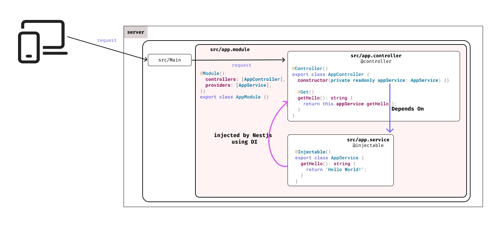
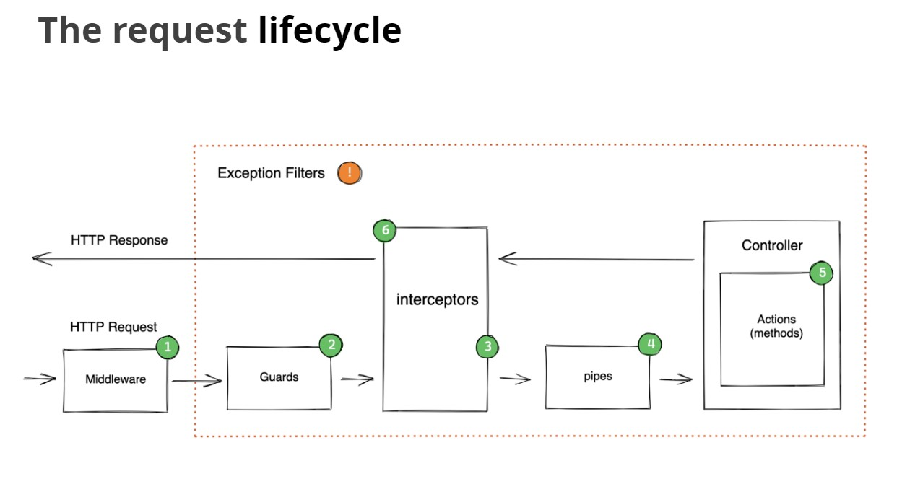
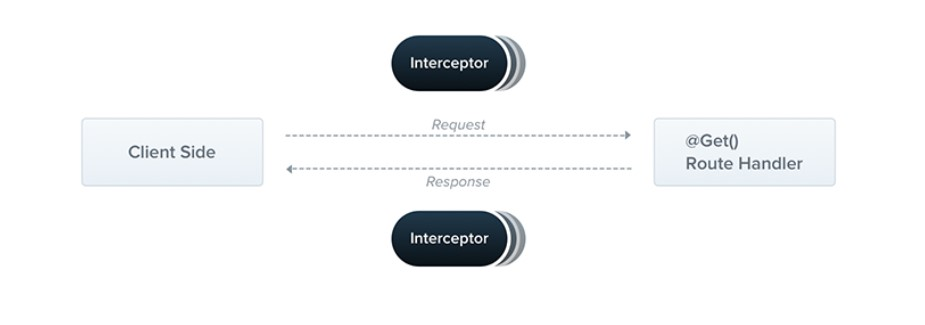

# Nest.js

- [Nest.js](#nestjs)
  - [Basic Concepts in Nest.js](#basic-concepts-in-nestjs)
    - [NestJS Modules](#nestjs-modules)
  - [Controller](#controller)
    - [Accessing Route parameters](#accessing-route-parameters)
    - [Request Body](#request-body)
    - [Query](#query)
      - [array query-string](#array-query-string)
  - [🚀Service Provider](#service-provider)
  - [✅✅Validating `Request` Object with `Pipes` and `DTOs`](#validating-request-object-with-pipes-and-dtos)
    - [Validating Params using Built-in `pipes`](#validating-params-using-built-in-pipes)
    - [Validating Body using Class Validator and Dtos](#validating-body-using-class-validator-and-dtos)
        - [⚠️Whitelisting Undesired Properties⚠️](#️whitelisting-undesired-properties️)
  - [🔓🔓Transforming the `Response` With `Interceptors`](#transforming-the-response-with-interceptors)
    - [🌟🌟Creating Response DTO](#creating-response-dto)
      - [🔀Enable Class Transformation](#enable-class-transformation)
    - [Transforming a Property With the `Expose` Decorator](#transforming-a-property-with-the-expose-decorator)
    - [(Optional) Custom Interceptor](#optional-custom-interceptor)
      - [Defining and Registering Custom interceptors](#defining-and-registering-custom-interceptors)
      - [Custom ClassSerializerInterceptor](#custom-classserializerinterceptor)
  - [`.env` and `Logger`](#env-and-logger)

## Basic Concepts in Nest.js

### NestJS Modules

Nest is built around a language feature called [decorators](https://medium.com/google-developers/exploring-es7-decorators-76ecb65fb841).

Key component in Nest.js are:

- Each application has at least one module - the `root` module.
- That is the starting point of the application.
- Modules are an effective way to organize components by a closely related set of capabilities (e.g. per feature).
- Modules are `singletons`, therefore a module can be imported by multiple other modules.

The `@Module()` decorator takes a single object whose properties describe the module:

| Properties    | Working                                                                                                                                                   |
| ------------- | --------------------------------------------------------------------------------------------------------------------------------------------------------- |
| `providers`   | list of **service providers** to shared across the module via dependency injection                                                                        |
| `controllers` | list of **route controller** to be instantiated within the module                                                                                         |
| `exports`     | list of **service provider** to export to other module. You can use either the provider itself or just its token (provide value)                          |
| `imports`     | list of  **modules** required by this module. Any exported service provider by those modules will now be available in our module via dependency injection |

<div align="center">
  
</div>

## Controller

Controllers are responsible for handling incoming `requests` and returning `responses` to the client.

```typescript
@Controller()
export class AppController {
  // http://localhost:3000/api/route1
  @Get('api/route1')
  api1(): string {
    return 'route:api/route1';
  }

  // http://localhost:3000/api/route2
  @Get('api/route2')
  api2(): string {
    return 'route:api/route2';
  }
}
```

Using a path prefix in a `@Controller()` decorator allows us to easily group a set of related routes, and minimize repetitive code. For example, we may choose to group a set of routes that manage interactions with a api entity under the route `/api`. In that case, we could specify the path prefix `api` in the `@Controller()` decorator so that we don't have to repeat that portion of the path for each route in the file.

```typescript
@Controller('api')
export class AppController {
  // http://localhost:3000/api/route1
  @Get('route1')
  api1(): string {
    return 'route:api/route1';
  }

  // http://localhost:3000/api/route2
  @Get('route2')
  api2(): string {
    return 'route:api/route2';
  }
}
```

Using Global Prefix:

```typescript
import { NestFactory } from '@nestjs/core';
import { AppModule } from './app.module';

async function bootstrap() {
  const app = await NestFactory.create(AppModule);
  app.setGlobalPrefix('api');
  await app.listen(3000);
}
bootstrap();
```

### Accessing Route parameters

Routes with static paths won't work when you need to accept **dynamic data** as part of the request
(e.g., `GET /api/1` to get cat with id `1`)

```typescript
  @Get(':id')
  findOne(@Param() params): string {
    console.log(params.id);
    return `ID: ${params.id}`;
  }
```

```typescript
  @Get(':id')
  findOne(@Param('id') id: string): string {
    return `This action returns a #${id} cat`;
  }
```

**Accessing Multiple Route parameters:**

```typescript
  @Get(':id/:n')
  api(@Param('id') id: string, @Param('n') n: string): string {
    console.log(id);
    console.log(n);
    return `${id} ${n}`;
  }
```

### Request Body

```typescript
  @Post('register')
  register(@Body() body: { name: string; pass: string }) {
    console.log(body);//{ name: 'a', pass: 'b' }

    return body;
  }
```

```typescript
  @Put(':id/:n')
  updateUser(
    @Param('id') id: string,
    @Param('n') n: string,
    @Body() body: { name: string; pass: string },
  ) {
    console.log(id);
    console.log(n);
    console.log(body);
    return body;
  }
```

### Query

```typescript
  @Get()
  api(
    @Query('product') product: string,
    @Query('minPrice') minPrice: string,
    @Query('maxPrice') maxPrice: string,
    @Query('cat') cat: string,
  ): string {
    console.log(product, minPrice, maxPrice, cat); //iPhone 1000 1500 phone
    return `${product} ${minPrice} ${maxPrice} ${cat}`;
  }
```

```typescript
  @Get()
  api(@Query() q): string {
    console.log(q); //{ product: 'iPhone', minPrice: '1000', maxPrice: '1500', cat: 'phone' }
    return q;
  }
```

#### array query-string

`GET: ~/api?arr=1&arr=2&arr=3`

```typescript
  @Get()
  api(@Query("arr") arr?: string[]) {
    console.log(arr); //  {arr: [ '1', '2', '3' ]}
    return "";
  }
```

`GET: ~/api?arr[0]=1&arr[1]=2&arr[1]=3`

```typescript
  @Get()
  api(@Query("arr") arr?: string[]) {
    console.log(arr); //  {arr: [ '1', [ '2', '3' ] ]}
    return "";
  }
```

## 🚀Service Provider

<div align="center">
  
</div>

```typescript
// src/app.module.ts
@Module({
  controllers: [AppController],
  providers: [AppService],
})
export class AppModule {}


// src/app.service.ts
import { Injectable } from '@nestjs/common';
@Injectable()
export class AppService {
  getHello(): string {
    return 'Hello World!';
  }
}

// src/app.controller.ts
@Controller('api')
export class AppController {
  // Injecting Service
  constructor(private readonly appService: AppService) {}

  @Get()
  api2(): string {
    return this.appService.getHello();
  }
}
```

## ✅✅Validating `Request` Object with `Pipes` and `DTOs`

<div align="center">

</div>

Pipes have two typical use cases:

- `transformation`: transform input data to the desired form (e.g., from string to integer)
- `validation`: evaluate input data and if valid, simply pass it through unchanged; otherwise, throw an exception when the data is incorrect

In both cases, pipes operate on the arguments being processed by a controller route handler. Nest interposes a pipe just before a method is invoked, and the pipe receives the arguments destined for the method and operates on them. Any transformation or validation operation takes place at that time, after which the route handler is invoked with any (potentially) transformed arguments.

Nest comes with a number of built-in pipes that you can use out-of-the-box.

Nest comes with nine pipes available out-of-the-box:

- `ValidationPipe`
- `ParseIntPipe`
- `ParseFloatPipe`
- `ParseBoolPipe`
- `ParseArrayPipe`
- `ParseUUIDPipe`
- `ParseEnumPipe`
- `DefaultValuePipe`
- `ParseFilePipe`

### Validating Params using Built-in `pipes`

```typescript
  @Get(':id')
  api2(@Param('id', ParseIntPipe) id: number) {
    console.log(id, typeof id);// 1 number
    return { id: id };
  }
```

This ensures that one of the following two conditions is true: either the parameter we receive is a `number`, or an `exception` is thrown before the route handler is called:

```bash
http://localhost:3000/api/1

{
  "id": 1
}

http://localhost:3000/api/asdsad

{
  "statusCode": 400,
  "message": "Validation failed (numeric string is expected)",
  "error": "Bad Request"
}

```

Enum Example:

```typescript
@Controller('api')
export class AppController {
  constructor(private readonly appService: AppService) {}
  @Get(':type')
  api2(@Param('type', new ParseEnumPipe(UserType)) userType: UserType) {
    return { type: userType };
  }
}
```

```bash
http://localhost:3000/api/USER
{
  "type": "USER"
}

http://localhost:3000/api/user

{
  "statusCode": 400,
  "message": "Validation failed (enum string is expected)",
  "error": "Bad Request"
}
```

### Validating Body using Class Validator and Dtos

```bash
yarn add class-validator class-transformer
```

```typescript
import { IsNumber, IsPositive, IsString, IsNotEmpty } from 'class-validator';

export class CreateUserDto {
  @IsString()
  @IsNotEmpty()
  name: string;
  @IsString()
  @IsNotEmpty()
  pass: string;
  @IsNumber()
  @IsPositive()
  age: number;
}

@Controller('api')
export class AppController {
  constructor(private readonly appService: AppService) {}
  @Post()
  api2(@Body() body: CreateUserDto) {
    return body;
  }
}
```

enable global validation in `src/main`:

```typescript
async function bootstrap() {
  const app = await NestFactory.create(AppModule);
  app.useGlobalPipes(new ValidationPipe());
  await app.listen(3000);
}
bootstrap();
```

```bash
http://localhost:3000/api
body:
{
  "name":"jhon",
  "pass":"jhonx",
  "age":33
}

Response:
{
  "name":"jhon",
  "pass":"jhonx",
  "age":33
}

body:
{
  "name":1,
  "pass":2,
  "age":"33"
}
Response:
{
  "statusCode": 400,
  "message": [
    "name must be a string",
    "pass must be a string",
    "age must be a positive number",
    "age must be a number conforming to the specified constraints"
  ],
  "error": "Bad Request"
}

```

Making Properties Optional:

```typescript
export class CreateUserDto {
  //..

  @IsOptional()
  @IsNumber()
  @IsPositive()
  age: number;
}
```

```bash
# Req:
{
  "name":"jhon",
  "pass":"jhonx"
}
# Res: 201 Created
# Req:
{
  "name":"jhon",
  "pass":"jhonx"
}
# Res:
{
  "statusCode": 400,
  "message": [
    "pass should not be empty",
    "pass must be a string"
  ],
  "error": "Bad Request"
}
```

##### ⚠️Whitelisting Undesired Properties⚠️

If we had extra properties in the body, it gets passes

```bash
# body:
{
  "name":"jhon",
  "pass":"jhonx",
  "extra":"hacked"
}
# console:
{
  "name":"jhon",
  "pass":"jhonx",
  "extra":"hacked"
}
```

We can remove everything but our defined properties with `whitelist:true`:

```typescript
app.useGlobalPipes(
    new ValidationPipe({
      whitelist: true,
    }),
  );
```

```bash
# body:
{
  "name":"jhon",
  "pass":"jhonx",
  "extra":"hacked"
}
# console:
{
  "name":"jhon",
  "pass":"jhonx",
}
```

## 🔓🔓Transforming the `Response` With `Interceptors`

<div align="center">

</div>

<div align="center">

</div>

### 🌟🌟Creating Response DTO

```typescript
import { Exclude } from 'class-transformer';

export class UserResponseDto {
  id: string;
  name: string;
  pass: string;
  @Exclude()
  update_at: Date;
}

@Controller('api')
export class AppController {
  constructor(private readonly appService: AppService) {}
  @Get('')
  api(): UserResponseDto {
    const user = {
      id: '1',
      name: 'jhon',
      pass: 'jhonx',
      update_at: new Date(),
    };

    return new UserResponseDto(user);
  }
  @Get('/all')
  apiAll(): UserResponseDto[] {
    const users = [
      {
        id: '1',
        name: 'jhon',
        pass: 'jhonx',
        update_at: new Date(),
        created_at: new Date(),
      },
      {
        id: '2',
        name: 'jhon',
        pass: 'jhonx',
        update_at: new Date(),
      },
    ];
    // with array
    return users.map((user) => new UserResponseDto(user));
  }
}

```

But still response has `update_at` property

```bash
{
  "id": "1",
  "name": "jhon",
  "pass": "jhonx",
  "update_at": "2022-08-02T19:06:03.100Z"
}
```

We still have more work to do:

```typescript
import { Exclude } from 'class-transformer';

export class UserResponseDto {
  id: string;
  name: string;
  pass: string;

  @Exclude()
  update_at: Date;

  constructor(partial: Partial<UserResponseDto>) {
    Object.assign(this, partial);
  }
}

@Controller('api')
export class AppController {
  constructor(private readonly appService: AppService) {}
  @Get()
  api(): UserResponseDto {
    const user = {
      id: '1',
      name: 'jhon',
      pass: 'jhonx',
      update_at: new Date(),
    };
    return new UserResponseDto(user);
  }
}
```

But still response has `update_at` property

```bash
{
  "id": "1",
  "name": "jhon",
  "pass": "jhonx",
  "update_at": "2022-08-02T19:11:17.006Z"
}
```

Because we have to enable few option in nest.js to get this works:

#### 🔀Enable Class Transformation

Modification need in `src/main.ts`:

```typescript
import { ValidationPipe } from '@nestjs/common';
import { NestFactory } from '@nestjs/core';
import { AppModule } from './app.module';
async function bootstrap() {
  const app = await NestFactory.create(AppModule);
  app.useGlobalPipes(
    new ValidationPipe({
      whitelist: true,
      transform: true,
      transformOptions: {
        enableImplicitConversion: true,
      },
    }),
  );
  await app.listen(3000);
}
bootstrap();
```

Modification need in `src/app.module.ts`:

```typescript
import { ClassSerializerInterceptor, Module } from '@nestjs/common';
import { APP_INTERCEPTOR } from '@nestjs/core';
import { AppController } from './app.controller';
import { AppService } from './app.service';

@Module({
  controllers: [AppController],
  providers: [
    AppService,
    {
      provide: APP_INTERCEPTOR,
      useClass: ClassSerializerInterceptor,
    },
  ],
})
export class AppModule {}
```

Now:

```bash
{
  "id": "1",
  "name": "jhon",
  "pass": "jhonx",
}
```

### Transforming a Property With the `Expose` Decorator

```typescript
import { Exclude, Expose } from 'class-transformer';

export class UserResponseDto {
  id: string;
  name: string;
  pass: string;

  @Expose({ name: 'createdAt' })
  transformCratedAt() {
    return this.created_at;
  }
  @Exclude()
  update_at: Date;

  @Exclude()
  created_at: Date;

  constructor(partial: Partial<UserResponseDto>) {
    Object.assign(this, partial);
  }
}

@Controller('api')
export class AppController {
  constructor(private readonly appService: AppService) {}
  @Get()
  api(): UserResponseDto {
    const user = {
      id: '1',
      name: 'jhon',
      pass: 'jhonx',
      update_at: new Date(),
      created_at: new Date(),
    };

    return new UserResponseDto(user);
  }
}
```

```bash
# res:
{
  "id": "1",
  "name": "jhon",
  "pass": "jhonx",
  "createdAt": "2022-08-02T19:21:32.177Z"
}
```

### (Optional) Custom Interceptor

#### Defining and Registering Custom interceptors

```typescript
// custom.interceptor.ts
import { CallHandler, ExecutionContext, NestInterceptor } from '@nestjs/common';
import { map } from 'rxjs';

export class CustomInterceptor implements NestInterceptor {
  intercept(context: ExecutionContext, handler: CallHandler) {


    console.log('INTERCEPTING REQUEST');
    console.log( context);

    // anything above is intercepting request object

    return handler.handle().pipe(
      map((data) => {
        // anything here is intercepting response object
        console.log('INTERCEPTING RESPONSE');
        return data;
      }),
    );
  }
}
```

```typescript
// app.module.ts
import { CustomInterceptor } from './custom.intercepter';

@Module({
  controllers: [AppController],
  providers: [
    AppService,
    {
      provide: APP_INTERCEPTOR,
      useClass: CustomInterceptor,
    },
  ],
})
export class AppModule {}
```

#### Custom ClassSerializerInterceptor

```typescript
import { CallHandler, ExecutionContext, NestInterceptor } from '@nestjs/common';
import { map } from 'rxjs';

export class CustomInterceptor implements NestInterceptor {
  intercept(context: ExecutionContext, handler: CallHandler) {
    return handler.handle().pipe(
      map((data) => {
        const response = {
          ...data,
          createdAt: data.created_at,
        };

        delete response.update_at;
        delete response.created_at;

        return response;
      }),
    );
  }
}
```

## `.env` and `Logger`

[https://docs.nestjs.com/techniques/configuration](https://docs.nestjs.com/techniques/configuration)

To begin using it, we first install the required dependency.

```bash
yarn add @nestjs/config
```

```typescript
import { Module } from '@nestjs/common';
import { ConfigModule } from '@nestjs/config';

@Module({
  imports: [ConfigModule.forRoot()],
})
export class AppModule {}
```

The above code will load and parse a `.env` file from the default location (the project `root` directory), merge key/value pairs from the `.env` file with environment variables assigned to `process.env`, and store the result in a private structure that you can access through the `ConfigService`.

A sample .env file looks something like this:

```bash
NODE_ENV=development
```

`src/main.ts` boilerplate:

```typescript
import { Logger, ValidationPipe } from '@nestjs/common';
import { NestFactory } from '@nestjs/core';
import { AppModule } from './app.module';

async function bootstrap() {
  const app = await NestFactory.create(AppModule);
  const logger = new Logger('App');
  app.setGlobalPrefix('api');
  app.useGlobalPipes(
    new ValidationPipe({
      whitelist: true,
      transform: true,
      transformOptions: {
        enableImplicitConversion: true,
      },
    }),
  );
  if (process.env.NODE_ENV === 'development')
    logger.log(`App started at http://localhost:3000/api/`);
  await app.listen(3000);
}
bootstrap();

```

```typescript
import { Logger, Injectable } from '@nestjs/common';

@Injectable()
class MyService {
  private readonly logger = new Logger(MyService.name);

  doSomething() {
    this.logger.log('Doing something...');
  }
}
```
