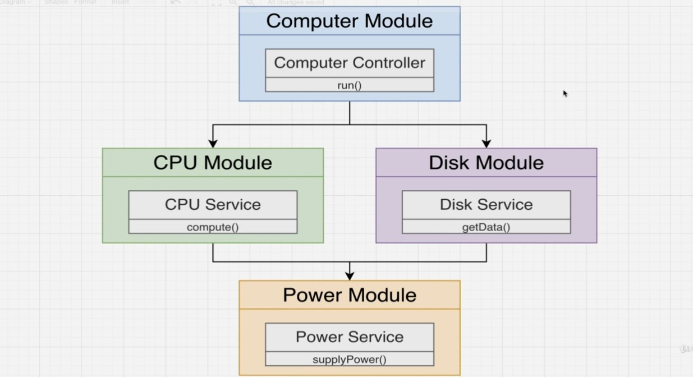
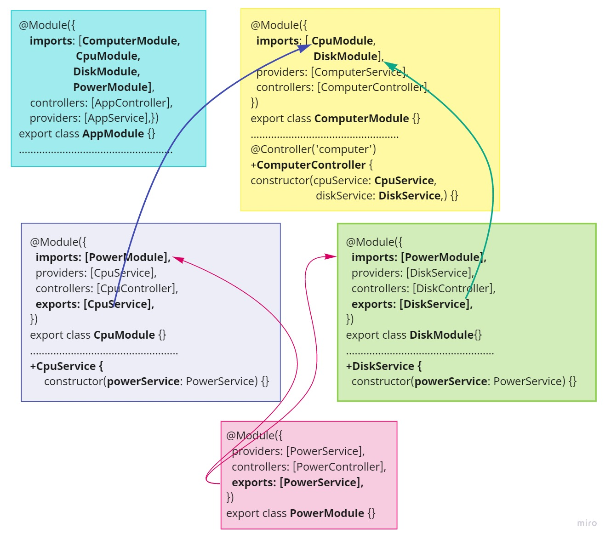

# Working With Multiple Module

```bash
nest g mo computer
nest g mo cpu
nest g mo disk
nest g mo power
nest g s computer
nest g s cpu
nest g s disk
nest g s power
nest g co computer
nest g co cpu
nest g co disk
nest g co power
```

Map:





> Note: NOTE: `export` **Services** and `import` **Modules**