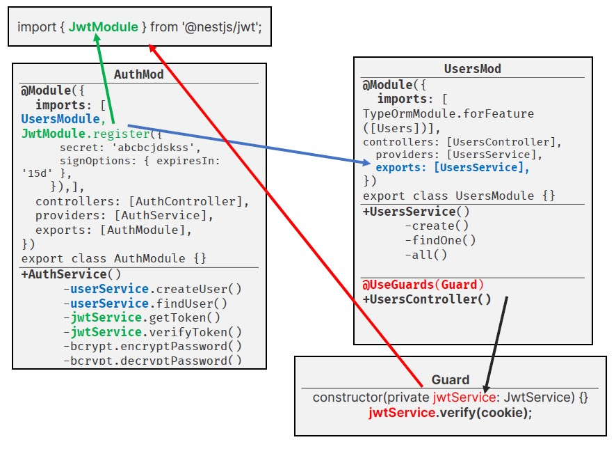
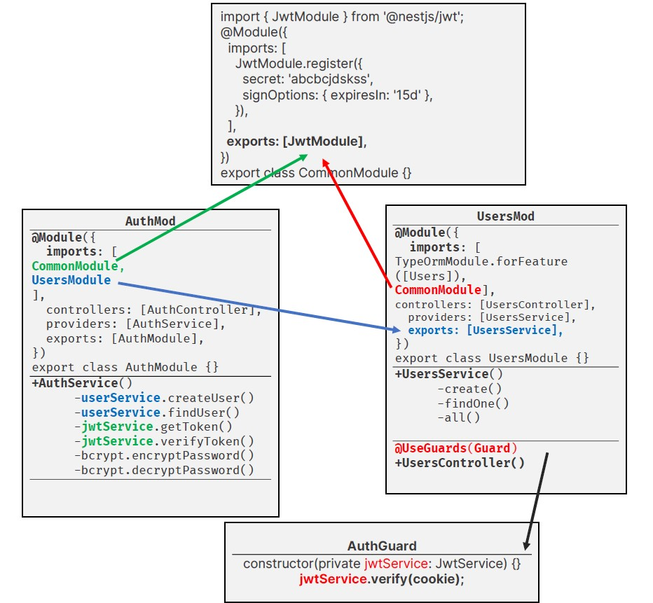

<p align="center">
  <a href="http://nestjs.com/" target="blank"></a>
</p>

[circleci-image]: https://img.shields.io/circleci/build/github/nestjs/nest/master?token=abc123def456
[circleci-url]: https://circleci.com/gh/nestjs/nest

  <p align="center">A progressive <a href="http://nodejs.org" target="_blank">Node.js</a> framework for building efficient and scalable server-side applications.</p>
    <p align="center">

## Description

<p align="center">
  
</p>

As the `UserModule` uses `Guard/AuthGuard` to protect routes, where `AuthGuard` depends on `jwtService` or `jwtModule` , but inside `UserModule` we haven’t **imported** `jwtModule`. So, we also needs to import `jwtModule` inside `UserModule`.

```typescript
@Module({
  imports: [
    TypeOrmModule.forFeature([Users]),
    JwtModule.register({
      secret: 'abcbcjdskss',
      signOptions: {
        expiresIn: '15d'
      }
    })
  ],
  controllers: [UsersController],
  providers: [UsersService],
  exports: [UsersService], })

 export class UsersModule {}
```

But!! We are importing `JwtModule` multiple times as both `UserModule` and `AuthModule` **depends** on `JwtModule`. To avoid this use can use a `CommonModule` for providing `JwtModule`.

<p align="center">
  
</p>

## Installation

```bash
$ npm install
```

## Running the app

```bash
# development
$ npm run start

# watch mode
$ npm run start:dev

# production mode
$ npm run start:prod
```

## Test

```bash
# unit tests
$ npm run test

# e2e tests
$ npm run test:e2e

# test coverage
$ npm run test:cov
```

## Support

Nest is an MIT-licensed open source project. It can grow thanks to the sponsors and support by the amazing backers. If you'd like to join them, please [read more here](https://docs.nestjs.com/support).

## Stay in touch

- Author - [Kamil Myśliwiec](https://kamilmysliwiec.com)
- Website - [https://nestjs.com](https://nestjs.com/)
- Twitter - [@nestframework](https://twitter.com/nestframework)

## License

Nest is [MIT licensed](LICENSE).
