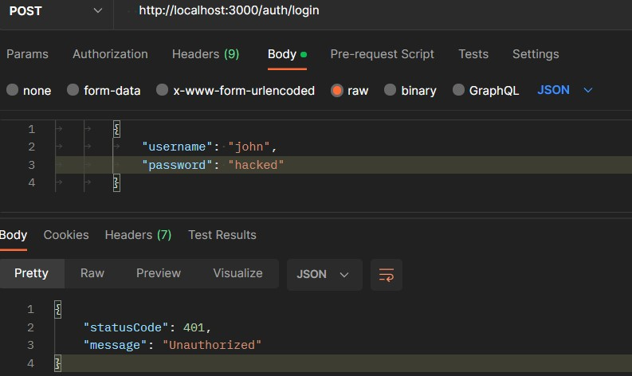
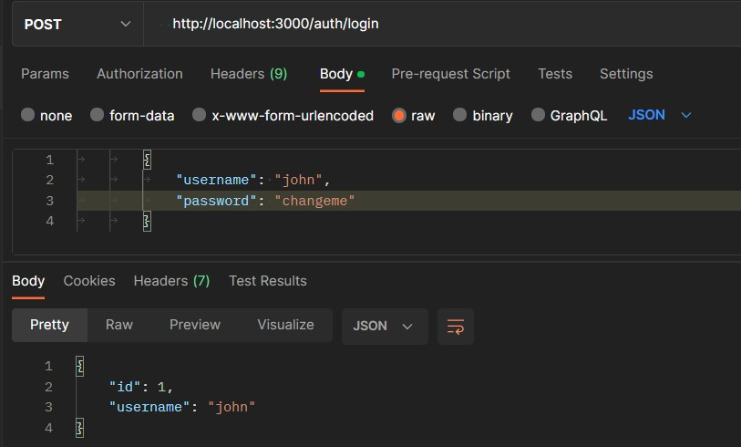
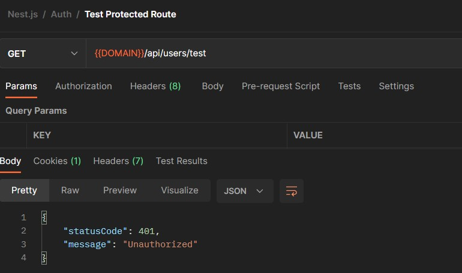
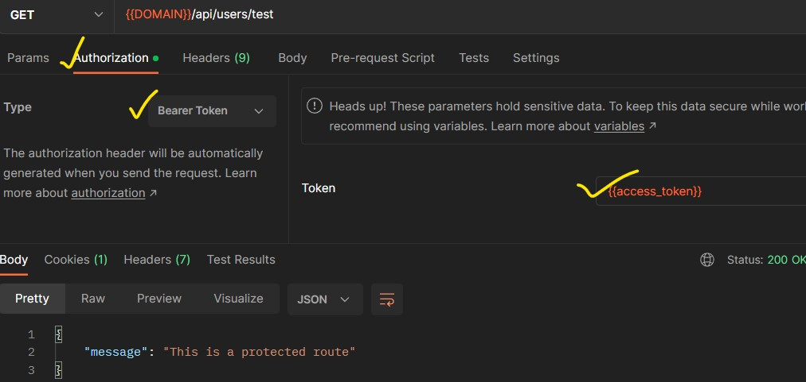

# Implement Passport.js in Nest.js

- [Implement Passport.js in Nest.js](#implement-passportjs-in-nestjs)
  - [Resources](#resources)
  - [Installation](#installation)
  - [Init Project](#init-project)
  - [Implementing Passport local](#implementing-passport-local)
    - [Create Passport Service](#create-passport-service)
    - [Built-in Passport Guards](#built-in-passport-guards)
      - [Login route](#login-route)
      - [Protecting endpoints: Session Strategy](#protecting-endpoints-session-strategy)
        - [Using Guards and Sessions](#using-guards-and-sessions)
      - [Protecting endpoints: JWT Strategy](#protecting-endpoints-jwt-strategy)


## Resources

- [https://www.youtube.com/watch?v=_L225zpUK0M&t=18s](https://www.youtube.com/watch?v=_L225zpUK0M&t=18s)
- [https://ownid.com/blog/how-to-implement-passport-js-in-nest-js-an-easy-tutorial/](https://ownid.com/blog/how-to-implement-passport-js-in-nest-js-an-easy-tutorial/)
- [https://docs.nestjs.com/security/authentication](https://docs.nestjs.com/security/authentication)

## Installation


```bash
yarn add @nestjs/passport passport passport-local express-session @nestjs/jwt passport-jwt
yarn add -D @types/passport-local @types/express-session

```

## Init Project

Create `users` and `auth` module

```bash
nest g mo auth
nest g s auth/local
nest g module users
nest g service users
```

- `auth` module: contains `local` strategy, `local` guard, `local` serializer; we can add more strategies, guards, serializers in `auth` module

> Rename `auth/local/local.service.ts` to `auth/local/local.auth.service.ts`; and rename `LocalService` to `LocalAuthService`

`users/users.service.ts`

```typescript
import { Injectable } from '@nestjs/common';

export interface User {
  id: number;
  username: string;
  password: string;
}

@Injectable()
export class UsersService {
  private readonly users: User[] = [
    {
      id: 1,
      username: 'john',
      password: 'changeme',
    },
    {
      id: 2,
      username: 'maria',
      password: 'guess',
    },
  ];

  async findOne(username: string): Promise<User | undefined> {
    return this.users.find((user) => user.username === username);
  }
}
```

`auth/local/local.auth.service.ts`

```typescript
import { Injectable } from '@nestjs/common';
import { UsersService } from 'src/users/users.service';

@Injectable()
export class LocalAuthService {
  constructor(private userService: UsersService) {}

  async validateUser(username: string, pass: string): Promise<any> {
    const user = await this.userService.findOne(username);
    if (user && user.password === pass) {
      // eslint-disable-next-line @typescript-eslint/no-unused-vars
      const { password, ...result } = user;
      return result;
    }
  }
}
```


make this `UsersService` exportable

`users/users.module.ts`

```typescript
import { Module } from '@nestjs/common';
import { UsersService } from './users.service';

@Module({
  providers: [UsersService],
  exports: [UsersService],
})
export class UsersModule {}
```

Import `UsersModule` in `AuthModule`

`auth/auth.module.ts`

```typescript
import { Module } from '@nestjs/common';
import { UsersModule } from 'src/users/users.module';
import { LocalAuthService } from './local/local.auth.service';

@Module({
  imports: [UsersModule],
  providers: [LocalAuthService],
})
export class AuthModule {}
```

## Implementing Passport local

### Create Passport Service

Now we can implement our Passport local authentication strategy by creating a service that extends the Passport `LocalStrategy` class. . Create a file called `local.strategy.service.ts` in the `auth/local` folder

`auth/local/local.strategy.service.ts`

```typescript
import { Injectable } from '@nestjs/common';
import { PassportStrategy } from '@nestjs/passport';
import { Strategy } from 'passport-local';

@Injectable()
export class LocalStrategyService extends PassportStrategy(Strategy) {
  constructor() {
    super();
  }
}
```

We need to add the `PassportModule` and `LocalStrategyService` into the `auth.module.ts` file.

```typescript
import { Module } from '@nestjs/common';
import { UsersModule } from 'src/users/users.module';
import { LocalAuthService } from './local/local.auth.service';
import { PassportModule } from '@nestjs/passport';
import { LocalStrategyService } from './local/local.strategy';

@Module({
  imports: [UsersModule, PassportModule],
  providers: [LocalAuthService, LocalStrategyService],
})
export class AuthModule {}

```

We also have to implemented the `validate()` method inside `LocalStrategyService` service. For each strategy, Passport will call the verify function (implemented with the `validate()` method in `@nestjs/passport`) using an appropriate strategy-specific set of parameters. For the local-strategy, Passport expects a validate() method with the following signature: `validate(username: string, password:string): any`.


```typescript
import { Injectable, UnauthorizedException } from '@nestjs/common';
import { PassportStrategy } from '@nestjs/passport';
import { Strategy } from 'passport-local';
import { LocalAuthService } from './local.auth.service';

@Injectable()
export class LocalStrategyService extends PassportStrategy(Strategy) {
  constructor(private readonly authService: LocalAuthService) {
    super();
  }
  async validate(username: string, password: string): Promise<any> {
    const user = await this.authService.validateUser(username, password);
    if (!user) throw new UnauthorizedException();
    return user;
  }
}
```

### Built-in Passport Guards

In the authentication step, we know we'll need to `POST` `username/password` credentials to initiate authentication, so we'll set up a `POST /auth/login` route to handle that. This raises the question: how exactly do we invoke the passport-local strategy in that route?

The answer is straightforward: by using another, **slightly different type of `Guard`**. The `@nestjs/passport` module provides us with a built-in Guard that does this for us. This Guard invokes the Passport strategy and kicks off the steps described above (retrieving credentials, running the verify function, creating the `user` property, etc).

The second case enumerated above (logged in user) simply relies on the **standard type of Guard** we already discussed to enable access to protected routes for logged in users.

#### Login route

To use passport built-in guards, create a file called `local.guard.ts` inside the `auth/local` directory.  Here, we’re extending the class `LocalAuthGuard` from `AuthGuard` from NestJS.

```typescript
import { Injectable } from '@nestjs/common';
import { AuthGuard } from '@nestjs/passport';

@Injectable()
export class LocalAuthGuard extends AuthGuard('local') {}
```

```typescript
import { Controller, Get, Post, Request, UseGuards } from '@nestjs/common';
import { AppService } from './app.service';
import { LocalAuthGuard } from './auth/local/local.guard';

@Controller()
export class AppController {
  constructor(private readonly appService: AppService) {}

  @UseGuards(LocalAuthGuard)
  @Post('auth/login')
  async login(@Request() req) {
    return req.user;
  }

}
```

Passport automatically creates a `user` object, based on the value we return from the `validate()` method, and assigns it to the Request object as req.user.*Later, we'll replace this with code to create and return a JWT instead.*

if you try to access the `/auth/login` route handler with wrong the `username` and `password` in the request body, you will get an error:

<div align="center">

</div>

Providing correct `username` and `password` in the request body, you will get the response:

<div align="center">

</div>

#### Protecting endpoints: Session Strategy

We'll use the session strategy to authenticate the user and allow them authorized access to the protected route.

For this to work, we need to save the session data when the user logs in. So we need to install the package `express-session` first. Now we need to add that along with passport in the root of our application. So in the `main.ts ` file, first import `session` and `passport`. After that, we're doing some boilerplate configuration here, per the documentation. The sessions data is stored as cookies, which are then used to authenticate users. Here, we've given the `maxAge` of the cookies in seconds.

```typescript

import { NestFactory } from '@nestjs/core';
import { AppModule } from './app.module';
import * as session from 'express-session';
import * as passport from 'passport';
async function bootstrap() {
  const app = await NestFactory.create(AppModule);
  //
  app.use(
    session({
      secret: 'secret',
      resave: false,
      saveUninitialized: false,
      cookie: {
        maxAage: 1000 * 60 * 60 * 24 * 7,
      },
    }),
  );
  app.use(passport.initialize());
  app.use(passport.session());

  await app.listen(3000);
}
bootstrap();
```

We need to create our session serializer now. So, create a file called `session.serializer.ts` inside the `auth/local` folder. This serializer decides which type of data we need to save in our session cookie. Here, we're saving the whole user object with the serializeUser method. We're also deserializing the payload to get the user data back.

`session.serializer.ts`:

```typescript
import { Injectable } from '@nestjs/common';
import { PassportSerializer } from '@nestjs/passport';

@Injectable()
export class SessionSerializer extends PassportSerializer {
  serializeUser(user: any, done: (err: Error, user: any) => void): any {
    done(null, user);
    // or done(null, user.id);
  }
  deserializeUser(
    payload: any,
    done: (err: Error, payload: string) => void,
  ): any {
    done(null, payload);
    // or done(null, { id: payload });
  }
}
```

Back in the `auth.module.ts` file, we need to add the `SessionSerializer`. We also need to update the `PassportModule` to use `session`.

```typescript
import { Module } from '@nestjs/common';
import { UsersModule } from 'src/users/users.module';
import { LocalAuthService } from './local/local.auth.service';
import { PassportModule } from '@nestjs/passport';
import { LocalStrategyService } from './local/local.strategy.service';
import { SessionSerializer } from './local/session.serializer';

@Module({
  imports: [UsersModule, PassportModule.register({ session: true })],
  providers: [LocalAuthService, LocalStrategyService, SessionSerializer],
})
export class AuthModule {}
```

We also need to update our `local.guard.ts` file. So that it uses the `session` strategy.

```typescript
import { ExecutionContext, Injectable } from '@nestjs/common';
import { AuthGuard } from '@nestjs/passport';

@Injectable()
export class LocalAuthGuard extends AuthGuard('local') {
  async canActivate(context: ExecutionContext) {
    const result = (await super.canActivate(context)) as boolean;
    const request = context.switchToHttp().getRequest();
    await super.logIn(request);
    return result;
  }
}
```

Finlay, we need to create a file called `authenticated.guard.ts` inside the `auth/local` folder. In it, we take the request from the context and check whether it's authenticated.

`auth\local\authenticated.guard.ts`

```typescript
import { CanActivate, ExecutionContext, Injectable } from '@nestjs/common';

@Injectable()
export class AuthenticatedGuard implements CanActivate {
  async canActivate(context: ExecutionContext) {
    const request = context.switchToHttp().getRequest();
    /*
      try {
            if (request.session.passport.user) {
                return true;
            }
        } catch (e) {
            throw new UnauthorizedException();
        }

      or simply:
    */
    return request.isAuthenticated();
  }
}
```

##### Using Guards and Sessions

We'll update our `app.controller.ts` file. The `GET` route can only be accessed if it's authenticated. Here, we're using the UseGuard decorator to run the AuthenticatedGuard and check if the user is authenticated.

```typescript
import { Controller, Get, Post, Request, UseGuards } from '@nestjs/common';
import { AppService } from './app.service';
import { AuthenticatedGuard } from './auth/local/authenticated.guard';
import { LocalAuthGuard } from './auth/local/local.guard';

@Controller()
export class AppController {
  constructor(private readonly appService: AppService) {}

  @UseGuards(AuthenticatedGuard)
  @Get('/public')
  async public() {
    return { message: 'public' };
  }

  @UseGuards(LocalAuthGuard)
  @Post('auth/login')
  async login(@Request() req) {
    return {
      message: 'Successfully logged in',
    };
  }
}
```


#### Protecting endpoints: JWT Strategy

> Note: Remove the `session` configurations

`main.ts`

```typescript
import { NestFactory } from '@nestjs/core';
import { AppModule } from './app.module';
async function bootstrap() {
  const app = await NestFactory.create(AppModule);
  await app.listen(3000);
}
bootstrap();
```

We can now address our final requirement: protecting endpoints by requiring a valid JWT be present on the request. Passport can help us here too. It provides the `passport-jwt` strategy for securing RESTful endpoints with JSON Web Tokens.

First,we have to create a **service** that will be responsible for validating the JWT and returning the user. We will call this service `JwtStrategy`. Create `src\auth\strategies\jwt.strategy.ts` and add the following code:

```typescript
import { ExtractJwt, Strategy } from 'passport-jwt';
import { PassportStrategy } from '@nestjs/passport';
import { Injectable } from '@nestjs/common';
import appConfig from 'src/config/app.config';

@Injectable()
export class JwtStrategy extends PassportStrategy(Strategy) {
	constructor() {
		super({
			jwtFromRequest: ExtractJwt.fromAuthHeaderAsBearerToken(),
			ignoreExpiration: false,
			secretOrKey: appConfig().jwtSecret
		});
	}

	async validate(payload: any) {
		// console.log(payload);

		return { email: payload.email, sub: payload.id };
	}
}
```

Add `JwtStrategy`  **service** to the `providers` array in `src/auth/auth.module.ts`:

```typescript
import { Module } from '@nestjs/common';
import { JwtModule } from '@nestjs/jwt';
import { UsersModule } from 'src/users/users.module';
import { AuthService } from './auth.service';
import { AuthController } from './auth.controller';
import { jwtConfig } from 'src/config/jwt.config';
import { JwtStrategy } from './strategies/jwt.strategy';

@Module({
	imports: [UsersModule, JwtModule.registerAsync(jwtConfig)],
	providers: [AuthService, JwtStrategy],
	controllers: [AuthController]
})
export class AuthModule {}
```

Finally, we define the `JwtAuthGuard` guard that will be used to protect our endpoints. Create `src\auth\guard\jwt-auth.guard.ts` and add the following code:


```typescript
import { Injectable } from '@nestjs/common';
import { AuthGuard } from '@nestjs/passport';

@Injectable()
export class JwtAuthGuard extends AuthGuard('jwt') {}
```

Now protect the any endpoint by adding the `JwtAuthGuard` guard to the `@UseGuards` decorator:


For example, `src\users\users.controller.ts`

```typescript
import { Controller, Get, Post, UseGuards } from '@nestjs/common';
import { JwtAuthGuard } from 'src/auth/guard/jwt-auth.guard';

@Controller('users')
export class UsersController {
	@UseGuards(JwtAuthGuard)
	@Get('test')
	protected() {
		return {
			message: 'This is a protected route'
		};
	}
}
```

<div align="center">

</div>


Provide the JWT in the `Authorization` header of the request:

**before that; saving the token in  Postman environment variable when we login or signup**. Set the following code in `Test` section of Postman:

```typescript
var res = pm.response.json();
console.log(res.access_token)
pm.environment.set('access_token', res.access_token);

var cookie =  pm.cookies.get('cookieToken');
console.log(cookie)
pm.environment.set('my_cookie',cookie);
```

<div align="center">

</div>