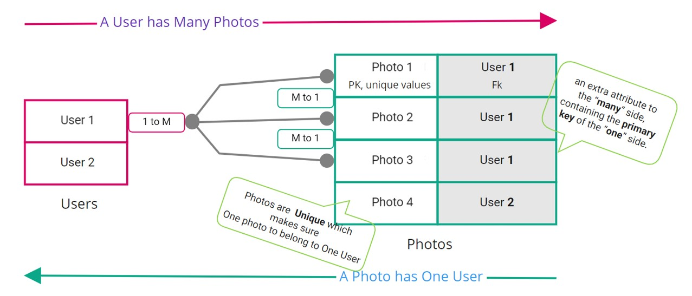
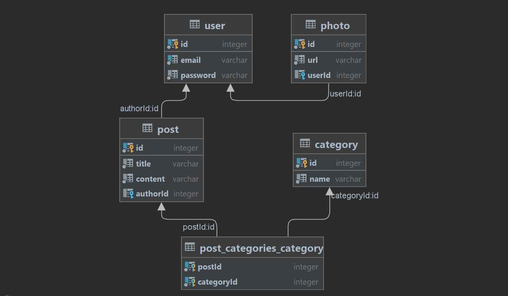

<p align="center">
  <a href="http://nestjs.com/" target="blank"></a>
</p>

[circleci-image]: https://img.shields.io/circleci/build/github/nestjs/nest/master?token=abc123def456
[circleci-url]: https://circleci.com/gh/nestjs/nest

  <p align="center">A progressive <a href="http://nodejs.org" target="_blank">Node.js</a> framework for building efficient and scalable server-side applications.</p>
    <p align="center">

# TypeORM

- [TypeORM](#typeorm)
  - [Define Models](#define-models)
    - [TimeStamps](#timestamps)
  - [Relations](#relations)
    - [One-to-many / Many-to-one](#one-to-many--many-to-one)
    - [Many to Many](#many-to-many)
    - [Get Meta Data](#get-meta-data)
  - [CRUD](#crud)
    - [CREATE [single]](#create-single)
    - [CREATE [One to Many]](#create-one-to-many)
    - [CREATE [Many to Many]](#create-many-to-many)
    - [READ [single entity]](#read-single-entity)
      - [FIND ALL](#find-all)
    - [READ [load relations]](#read-load-relations)
      - [FIND ALL](#find-all-1)
      - [FIND SINGLE](#find-single)
  - [`QueryBuilder`](#querybuilder)
    - [How to create and use a QueryBuilder](#how-to-create-and-use-a-querybuilder)
    - [Getting raw results: `getMany` vs `getRawMany`](#getting-raw-results-getmany-vs-getrawmany)
    - [Joining relations](#joining-relations)
      - [Loading Relations](#loading-relations)
      - [Partial selection](#partial-selection)
      - [Joining **unrelated** entity or table](#joining-unrelated-entity-or-table)
      - [Joining and mapping functionality](#joining-and-mapping-functionality)
      - [Working with Relations](#working-with-relations)

## Define Models

### TimeStamps

```typescript
@CreateDateColumn({
    type: 'timestamp',
    default: () => 'CURRENT_TIMESTAMP(6)',
  })
  created_at: Date;

  @UpdateDateColumn({
    type: 'timestamp',
    default: () => 'CURRENT_TIMESTAMP(6)',
    onUpdate: 'CURRENT_TIMESTAMP(6)',
  })
  updated_at: Date;
```

## Relations

### One-to-many / Many-to-one

```typescript
import { Column, Entity, OneToMany, PrimaryGeneratedColumn } from 'typeorm';
@Entity()
export class User {
  @PrimaryGeneratedColumn()
  id: number;

  @Column({ unique: true })
  email: string;

  @Column()
  password: string;

  @OneToMany(() => Photo, (photo) => photo.user, { cascade: true })
  //
  photos: Photo[];
  /**
   * !Notice that the User table has no `photos` field. Again, this is expected as
   * !the one-to-many relationship is captured in the `userId` field in the Photo
   * !table.
   *
   * *cascade: boolean | ("insert" | "update")[] - If set to true, the related object
   * will be inserted and updated in the database. You can also specify an array of
   * cascade options.
   *
   * ?For cascading to work in OnetoMany, Photo entity must have "onDelete/onUpdate"
   * property  which is set to "NO ACTION" by default
   */
}

@Entity()
export class Photo {
  @PrimaryGeneratedColumn()
  id: number;

  @Column()
  url: string;

  @ManyToOne( () => User, ( user ) => user.photos, {
    onDelete: "CASCADE",
    onUpdate:"CASCADE"
  })
  user: User;
  /**
   * !NOTE: as Photo is the many side ...
   * !typeorm will generate a foreign_key `userId`  referencing the user id.
   *
   * *onDelete: "RESTRICT"|"CASCADE"|"SET NULL" - specifies how foreign key
   * *should behave when referenced object is deleted
   *
   * ?For cascading to work in OnetoMany, Photo entity must have "onDelete/onUpdate"
   * property  which is set to "NO ACTION" by default
   */
}

```

```bash
+-------------+--------------+----------------------------+
|                         photo                           |
+-------------+--------------+----------------------------+
| id          | int(11)      | PRIMARY KEY AUTO_INCREMENT |
| url         | varchar(255) |                            |
| userId      | int(11)      | FOREIGN KEY                |
+-------------+--------------+----------------------------+

+-------------+--------------+----------------------------+
|                          user                           |
+-------------+--------------+----------------------------+
| id          | int(11)      | PRIMARY KEY AUTO_INCREMENT |
| name        | varchar(255) |                            |
+-------------+--------------+----------------------------+
```


### Many to Many

```typescript
@Entity()
class Post {
  @PrimaryGeneratedColumn()
  public id: number;

  @Column()
  public title: string;

  @Column()
  public content: string;

  @ManyToOne(() => User, (author: User) => author.posts, {
    onDelete: 'CASCADE',
  })
  public author: User;

  @ManyToMany(() => Category, (category: Category) => category.posts)
  @JoinTable()
  public categories: Category[];
}
/**
 * @JoinTable() is required for @ManyToMany relations
 *
 * When we use the  @ManyToMany() and  @JoinTable() decorators, TypeORM set ups an
 * additional table. This way, neither the Post nor Category table stores the data
 * about the relationship.
 *
 * Relations can be uni-directional and bi-directional. Uni-directional relations
 * are relations with a relation decorator only on one side. Bi-directional
 * relations are relations with decorators on both sides of a relation.
 *
 * @ManyToMany(() => Category, (category: Category) => category.posts)
 * @JoinTable()
 * public categories: Category[];
 *
 * @ManyToMany(() => Post, (post: Post) => post.categories)
 * public posts: Post[]
 *
*/
@Entity()
class Category {
  @PrimaryGeneratedColumn()
  public id: number;

  @Column()
  public name: string;

  @ManyToMany(() => Post, (post: Post) => post.categories, {
    onDelete: 'CASCADE',
    onUpdate: 'CASCADE',
  })
  public posts: Post[];
}
```




### Get Meta Data

```typescript
const columns = getConnection()
      .getMetadata(Photo)
      .ownColumns.map((i) => `${i.propertyName} `);

    const fk = getConnection()
      .getMetadata(Photo)
      .foreignKeys.map(
        (i) =>
          `${i.entityMetadata.name}.${i.columnNames} ref: ${i.referencedEntityMetadata.name}.${i.referencedColumnNames} onDELETE:${i.onDelete} `,
      );

    return { columns, fk };
```

list all foreign keys SQL: [https://gist.github.com/dev-SR/492ef45d1580af51e97a053e948cca70](https://gist.github.com/dev-SR/492ef45d1580af51e97a053e948cca70)


## CRUD

### CREATE [single]

```typescript
return this.userRepository.save(data);
```


### CREATE [One to Many]

```typescript
const user = new User();
user.name = "Leo";
await connection.manager.save(user);

const photo = new Photo();
photo.url = "me.jpg";
photo.user = user;
await connection.manager.save(photo);
```

```typescript
const user = User.findOne(condition)
const photo = new Photo();
photo.url = "me.jpg";
photo.user = user;
await connection.manager.save(photo);
```

### CREATE [Many to Many]

> Without Many to Many

```typescript
const post = new Post();
post.title = "dogs";
post.content = "who let the dogs out?";
await connection.manager.save(question);
```

> With Many to Many

```typescript
  // Create With New Category
  const category1 = new Category();
  category1.name = "animals";
  await connection.manager.save(category1);

  const category2 = new Category();
  category2.name = "zoo";
  await connection.manager.save(category2);

  const post = new Post();
  post.title = "dogs";
  post.content = "who let the dogs out?";
  post.categories = [category1, category2];
  await connection.manager.save(question);
```

```typescript
  const user = await this.userRepository.findOne({ id: user_id });
  const post = new Post();
  post.title = post.title;
  post.content = post.content;
  post.author = user;

  // !Save many to many Relation: Create Post With Existing Category 1,2
  const categories = await this.categoriesRepository.findByIds([1,2]);
  post.categories = categories;
  await this.postRepository.save(newPost);
```


### READ [single entity]

Details find options: [https://orkhan.gitbook.io/typeorm/docs/find-options](https://orkhan.gitbook.io/typeorm/docs/find-options)

#### FIND ALL

> SELECT.*

```typescript
await this.userRepository.find();
await this.userRepository.createQueryBuilder('u').getMany();
await this.userRepository.createQueryBuilder('u').getRawMany();
```

```sql
SELECT "u"."id" AS "u_id", "u"."email" AS "u_email", "u"."password" AS "u_password" FROM "user" "u"
```

For `getRawMany vs getMany`, Click [here](#getting-raw-results-getmany-vs-getrawmany)


> `SELECT columns`

```typescript
await this.userRepository
      .createQueryBuilder('u')
      .select('u.email', 'Email')
      .addSelect('u.id', "ID")
      .getRawMany();
```

```json
[
    {
        "ID": 1,
        "Email": "soikat@gmail.com"
    },
    {
        "ID": 2,
        "Email": "test@gmail.com"
    },
    //..
]
```

### READ [load relations]

#### FIND ALL

```typescript
await this.userRepository.find({relations: ['photos']});
//Sub-relations can also be loaded i.e. videos.video_attributes
await this.userRepository.find({relations: ['photos'], select: ['email'],});

// or from inverse side
await this.photoRepository.find({ relations: ['user'] });

```

```sql
SELECT  "User"."*"
        "User__photos"."*"
FROM "user" "User"
LEFT JOIN "photo" "User__photos" ON "User__photos"."userId"="User"."id"
```

```json
[
    {
        "id": 2,
        "email": "test@gmail.com",
        "password": "123",
        "photos": [
            {
                "id": 1,
                "url": "https://www.google.com/images/branding/googlelogo/1x/googlelogo_color_272x92dp.png"
            },
            {
                "id": 5,
                "url": "https://www.google.com/images/branding/googlelogo/1x/googlelogo_color_272x92dp.png"
            }
        ]
    },
    //...
]
```

#### FIND SINGLE

`findOne`

```typescript
await this.userRepository.findOne(id, { relations: ['photos'] });
```

```json
{
        "id": 2,
        "email": "test@gmail.com",
        "password": "123",
        "photos": [
            {
                "id": 1,
                "url": "https://www.google.com/images/branding/googlelogo/1x/googlelogo_color_272x92dp.png"
            },
            {
                "id": 5,
                "url": "https://www.google.com/images/branding/googlelogo/1x/googlelogo_color_272x92dp.png"
            }
        ]
}
```

`findOneOrFail`

```typescript
    try {
      const p = await this.userRepository.findOneOrFail(id, {
        relations: ['photos'],
      });
      return p;
    } catch (e) {
      return new NotFoundException(`User ${id} Not Found`);
    }
```

Equivalent to

```typescript
    const u1 = await this.userRepository.findOne(id, {
      relations: ['photos'],
      select: ['email'],
    });

    if (!u1) throw new NotFoundException(`User ${id} Not Found`);
    return u1;
```

## `QueryBuilder`

[https://github.com/typeorm/typeorm/blob/master/docs/select-query-builder.md#what-is-querybuilder](https://github.com/typeorm/typeorm/blob/master/docs/select-query-builder.md#what-is-querybuilder)

### How to create and use a QueryBuilder

There are several ways how you can create a Query Builder:

- Using repository:

```typescript
import {getRepository} from "typeorm";

const user = await getRepository(User)
    .createQueryBuilder("user")
    .where("user.id = :id", { id: 1 })
    .getOne();
```

### Getting raw results: `getMany` vs `getRawMany`

There are two types of results you can get using select query builder: `entities` and `raw` results. Most of the time, you need to select real entities from your database, for example, `Users`. For this purpose, you use `getOne` and `getMany`.

```typescript
await this.userRepository
      .createQueryBuilder('u')
      .getMany();
```

```json
[
    {
        "id": 1,
        "email": "soikat@gmail.com",
        "password": "123",
    },
    //...
]
```

Output matches Schema definition.

`However, sometimes you need to select specific data, like the sum of all user photos. Such data is not a entity, it's called raw data`. To get raw data, you use `getRawOne` and `getRawMany`. Examples:

```typescript
await this.userRepository
      .createQueryBuilder('u')
      .select('email')
      .getMany();
```

```json
[]
```

```typescript
await this.userRepository
      .createQueryBuilder('u')
      .select('email')
      .getRawMany();
```

```json
[
  { "email": "soikat@gmail.com", }, { "email": "soikat@gmail.com", },//...
]
```

### Joining relations

#### Loading Relations

> `leftJoinAndSelect(property: string, alias: string, condition?: string, parameters?: ObjectLiteral)`

```typescript
const u = getRepository(User)
        //Or, this.userRepository
        .createQueryBuilder('u') //alias
        .leftJoinAndSelect('u.photos', 'p');
        // load `photo` relation for `photos` property of user `u`, p is alias
return await u.getMany();
```

```sql
SELECT  "u"."*", "p"."*"
FROM "user" "u"
LEFT JOIN "photo" "p" ON "p"."userId"="u"."id"
```

```json
[
    {
        "id": 2,
        "email": "test@gmail.com",
        "password": "123",
        "photos": [
            {
                "id": 1,
                "url": "https://www.google.com/images/branding/googlelogo/1x/googlelogo_color_272x92dp.png"
            },
            {
                "id": 5,
                "url": "https://www.google.com/images/branding/googlelogo/1x/googlelogo_color_272x92dp.png"
            }
        ]
    },
    //...
]
```

Or, from inverse side

```typescript

const photos =
    .getRepository(Photo)
    .createQueryBuilder("photo")
    .leftJoinAndSelect("photo.user", "user")
    .getMany();
```

As you can see leftJoinAndSelect automatically loaded all of User's photos. **The first argument is the `relation` you want to load** and the **second argument is an `alias` you assign to this relation's table**.

You can use this alias anywhere in query builder. For example, let's take all Timber's photos which aren't removed.


```typescript
const user = await createQueryBuilder("u")
    .leftJoinAndSelect("u.photos", "photo")
    .where("u.name = :name", { name: "Timber" })
    .andWhere("photo.isRemoved = :isRemoved", { isRemoved: false })
    .getOne();
```

```sql
SELECT u.*, p.* FROM users u
    LEFT JOIN photos p ON p.userId = u.id
    WHERE u.name = 'Timber' AND p.isRemoved = FALSE
```

You can also add conditions to the join expression instead of using "where":

```typescript
const user = await createQueryBuilder("user")
    .leftJoinAndSelect("user.photos", "photo", "photo.isRemoved = :isRemoved", { isRemoved: false })
    .where("user.name = :name", { name: "Timber" })
    .getOne();
```

```sql
SELECT u.*, p.* FROM users u
    LEFT JOIN photos p ON p.userId = u.id AND p.isRemoved = FALSE
    WHERE u.name = 'Timber'
```

#### Partial selection

If you want to select only some entity properties, you can use the following syntax:


```typescript
await this.userRepository // Or, getRepository( User )
      .createQueryBuilder('u') //alias
      .leftJoinAndSelect('u.photos', 'p') //(property,alias,condition?)
      .select(['u.email', 'p.url']).getMany();
```

> `select` must be after leftJoinAndSelect methods:

```json
[
    {
        "email": "test@gmail.com",
        "photos": [
            {
                "url": "https://www.google.com/images/branding/googlelogo/1x/googlelogo_color_272x92dp.png"
            },
            {
                "url": "https://www.google.com/images/branding/googlelogo/1x/googlelogo_color_272x92dp.png"
            }
        ]
    },
    //...
]
```

```typescript
return await this.userRepository
      .createQueryBuilder('u')
      .leftJoinAndSelect('u.photos', 'p')
      .select(['u.email', 'p.url'])
      .where('u.id = :id', { id })
      // .where('u.id IN (:...id)', { id: [id] })
      .getOne();
```

```sql
SELECT 'u.email', 'p.url'
FROM "user" "u"
LEFT JOIN "photo" "p" ON "p"."userId"="u"."id" WHERE "u"."id" IN ($1)
```

```json
{
        "email": "test@gmail.com",
        "photos": [
            {
                "url": "https://www.google.com/images/branding/googlelogo/1x/googlelogo_color_272x92dp.png"
            },
            {
                "url": "https://www.google.com/images/branding/googlelogo/1x/googlelogo_color_272x92dp.png"
            }
        ]
}
```


#### Joining **unrelated** entity or table

You can join not only relations, but also other unrelated entities or tables. Examples:


```typescript
const user = await createQueryBuilder("user")
    .leftJoinAndSelect(Photo, "photo", "photo.userId = user.id")
    .getMany();

const user = await createQueryBuilder("user")
    .leftJoinAndSelect("photos", "photo", "photo.userId = user.id")
    .getMany();
```


#### Joining and mapping functionality

#### Working with Relations
